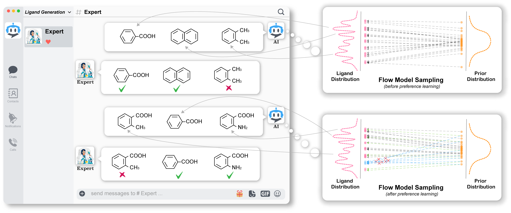

# Human-in-the-loop De novo Drug Design by Preference Learning (HIL-DD)

## About
This directory contains the code and resources of the following paper:

<i>"Human-in-the-loop De novo Drug Design by Preference Learning". Under review. </i>

1. HIL-DD is a new Human-In-the-Loop Drug Design framework that enables human experts and AI to co-design molecules in 3D space conditioned on a protein pocket.

2. The backbone model is a surprisingly simple generative model called rectified flow (RF) based on ordinary differential equation (ODE) [1-2]. 
By combining equivariant graph neural networks (EGNNs) [3], we create an equivariant rectified flow model (ERFM).

3. Our HIL-DD framework is built upon ERFM. It takes molecules generated by ERFM conditioning on a protein pocket as input, 
and incorporates human experts' preferences to generate new molecules with human preferences.

4. Our experimental results are based on the CrossDocked dataset [4], which is available 
[here](https://drive.google.com/drive/folders/1CzwxmTpjbrt83z_wBzcQncq84OVDPurM).

5. If you have any issues using this software, please do not hesitate to contact Youming Zhao (youming0.zhao@gmail.com). 
We will try our best to assist you. Any feedback is highly appreciated.

---

## Overview of the Model
We introduce HIL-DD to bridge the gap between human experts and AI. Please check out [this 1.5-minute video](https://drive.google.com/file/d/1LlnnQ3CXMwOqCMVAa_gD3ZwvV-lwfkpa/view?usp=drive_link) for a real-time interaction which showcases 
how human experts inject their preference (better vina scores in this case) into HIL-DD and then HIL-DD learns the preference quickly.

<p align="center">
  
</p>

### Step 1. Construct an equivariant rectified flow model (ERFM) and train it on the CrossDocked dataset
In this step, we combine EGNNs and RF to create the ERFM. The ERFM is then trained on the CrossDocked dataset using protein pockets as a condition.

### Step 2. Generate samples
We utilize a well-trained ERFM to generate molecules conditioned on a protein pocket of interest.

### Step 3. Propose promising molecules as positive samples and unpromising molecules as negative samples
According to a specific preference, say binding affinity, given the generated samples, we select molecules with high binding affinity (measured by Vina score in our work) as promising samples, 
and molecules with low binding affinity as unpromising samples.

### Step 4. Employ our HIL-DD algorithm to finetune ERFM
With the human annotations obtained from the previous step, we finetune the well-trained ERFM using the HIL-DD algorithm.

For more detailed information, please refer to our paper.


## Sub-directories
- [configs] contains configuration files for training, sampling, and finetuning.
  - [statistics] includes statistics about the training data, such as bond-length distribution, 
bond-angle distribution, and dihedral-angle distribution, etc.
- [datasets] contains files for preprocessing data.
- [models] contains the architectures of ERFM and the classifier.
- [toy-experiment] contains code for conducting a toy experiment to validate our algorithm.
- [utils] contains various helper functions.

---

## Toy experiment
Before you check out our ERFM and HIL-DD, you can try to run the [toy experiment](./toy-experiment/). You will see 
the beauty of preference learning in a few minutes.

---

## Dependencies

We recommend using [Anaconda](https://docs.anaconda.com/free/anaconda/install/index.html) to 
create an environment for installing all dependencies. If you have Anaconda installed, please run the following command 
to install all packages. Normally, this can be done within a few minutes:

```shell
conda create --name HIL-DD --file configs/spec-file.txt
```

The main dependencies are as follows:

- Python=3.10
- **PyTorch==1.12.1**
- PyTorch Geometric==2.1.0
- NumPy==1.23.3
- OpenBabel==3.1.1
- RDKit==2022.03.5
- QVina==2.1.0
- SciPy==1.9.1

---

## Vina Docking Score Calculation

To calculate Vina docking scores, you need to download the full protein pocket files from 
[here](https://drive.google.com/file/d/1gyrSIy8uYjtWgzhP5tQxptyR9QlN2o3R/view?usp=sharing) and 
place them in the `configs` folder. Then, unzip the files.

### Prepare Receptor Files

If all your experiments are based on the CrossDocked dataset, please skip the following two steps.

If you want to compute the binding affinity for the generated molecules conditioned on your own pocket, 
it is recommended to create a separate environment to install [MGLTools](https://anaconda.org/bioconda/mgltools). 
This is because MGLTools and [OpenBabel](https://anaconda.org/conda-forge/openbabel) may not be compatible. 

1. Put the untailored PDB file under the `examples/` folder and run the following command:

```shell
python utils/prepare_receptor4.py -r examples/xxxx_full.pdb -o examples/xxxx_full.pdbqt
```

2. Put the tailored PDB file under `examples/`.

---

## Data

We trained/tested ERFM and HIL-DD using the same datasets as [SBDD](https://github.com/luost26/3D-Generative-SBDD), 
[Pocket2Mol](https://github.com/pengxingang/Pocket2Mol), and [TargetDiff](https://github.com/guanjq/targetdiff). 
If you only want to sample molecules for the pockets of the CrossDocked test set, 
we have stored those pockets in `configs/test_data_list.pt`, so you can skip the following steps.

1. Download the dataset archive `crossdocked_pocket10.tar.gz` and the split file `split_by_name.pt` from 
[this link](https://drive.google.com/drive/folders/1CzwxmTpjbrt83z_wBzcQncq84OVDPurM) and place them under `data/`.
2. Extract the TAR archive using the command: `tar -xzvf crossdocked_pocket10.tar.gz`.

Please note that it may take approximately 2 hours to preprocess the data when training ERFM or HIL-DD for the first time.

## Prepare proposals for HIL-DD

To prepare proposals for HIL-DD, please follow the steps below:

1. Choose a protein pocket of interest either from the test set or from another dataset. 
If the protein pocket of interest is a member of the CrossDocked test set, refer to 
[this .csv file](configs/PDB_ID_CrossDocked_testset.csv) for the corresponding PDB ID.

2. To sample molecules from the chosen protein pocket, use the following command:
```shell
python sampling.py --device cuda --config configs/sampling.yml --pocket_id 4 --num_samples 1000 
```
Make sure to replace the `--pocket_id` value with the index of the desired pocket. 
Run this command 13 times to generate 13 result files. These result files will be used to select good and bad samples. 
Note that if you don't mind the samples overlapping among the 12 preference injections, you can run the command only 3 times.

3. Move all the result files from `logs_sampling/datetime/sample-results/datetime.pt` to a new folder named `tmp/samples_pocket4`. 

4. Calculate the metrics for the samples using the following command:
```shell
python cal_metric_one_pocket.py tmp/samples_pocket4
```

5. Select the good and bad molecules using the command:
```shell
python select_proposals.py tmp/samples_pocket4 tmp/samples_pocket4_proposals
```
In the `select_proposals.py` file, you can specify the lower and upper thresholds for various preferences such as 
Vina score, bond angle, bond length, benzene ring, large ring, and dihedral angle deviation. By default, the thresholds 
for Vina score are -7 and -9. For more details, please refer to the last lines of the `select_proposals.py` file. 
The minimum number of positive and negative samples is determined by `config.pref.num_positive_samples x config.pref.proposal_factor` 
and `config.pref.num_negative_samples x config.pref.proposal_factor`, respectively.

---

## Code Usage

To train ERFM, use the following command:
```shell
python train_ERFM.py --device cuda --config configs/config_ERFM.yml
```

To sample with a pretrained ERFM for all 100 pockets in the CrossDocked test set, run the following command:
```shell
python sampling.py --device cuda --config configs/sampling.yml
```

To sample with a protein pocket that is not in the CrossDocked test set, make sure to place your PDB file under the `examples/` directory. 
Then, execute the following command:
```shell
python sampling4pocket.py --device cuda --config configs/sampling.yml --pdb_path examples/2V3R.pdb 
```
If you need to calculate the binding affinity, ensure that you have the complete protein pocket file in the `examples/` directory. 
Then, run the command as shown below:
```shell
python sampling4pocket.py --device cuda --config configs/sampling.yml --pdb_path examples/2V3R.pdb --receptor_path examples/2V3R_full.pdbqt
```

To finetune a pretrained ERFM, use the following command:
```shell
python HIL_DD_pref.py --device cuda --config configs/config_pref.yml
```

---

## License
HIL-DD is licensed under the Apache License, Version 2.0: http://www.apache.org/licenses/LICENSE-2.0

## Reference

[1]. Liu, Xingchao, et al. "Flow Straight and Fast: Learning to Generate and Transfer Data with Rectified Flow." ICLR (2023).

[2]. Liu, Qiang. "Rectified flow: A marginal preserving approach to optimal transport." arXiv preprint arXiv:2209.14577.

[3]. Satorras, Victor Garcia, et al. "E (n) equivariant graph neural networks." ICML (2021).

[4]. Francoeur, Paul G et al. "Three-dimensional convolutional neural networks and a cross-docked data set for structure-based drug design." Journal of chemical information and modeling. (2020).
