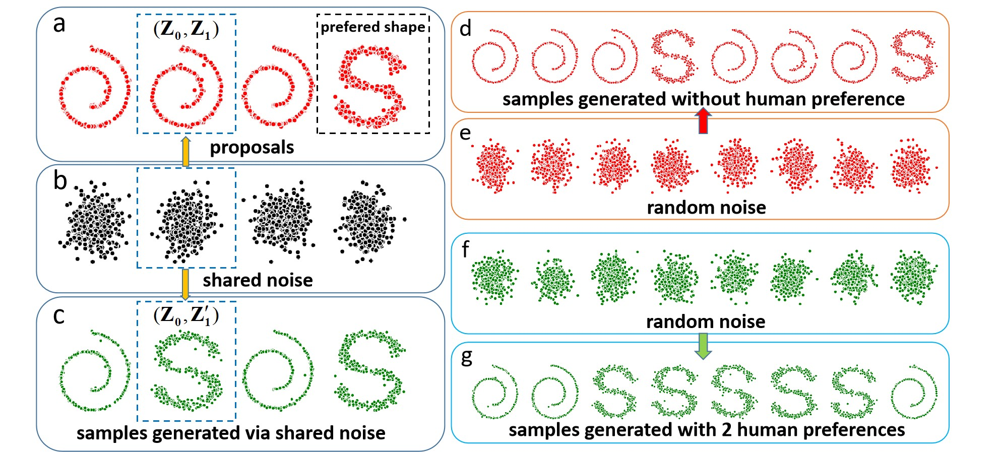

# Toy experiment of preference learning

## What does this code do?
This code does two things: 

    - learn a rectified flow toy model
    - learn human preferences with the trained rectified flow model


## Dependencies
Our code has been tested in the following environments:

| Package           | Version |
|---|---------|
| Python            | 3.10.6  |
| PyTorch           | 1.12.1  |
| CUDA              | 11.6    |
| Numpy             | 1.23.3  |

## Demo 
This image illustrates the power of our preference learning algorithm. You can check out the `Code usage` section and 
run our code to get the same effect within 5 minutes. 
<p align="center">
  
</p>

## Code usage
We recommend using the pretrained checkpoint to conduct the toy experiment. Specifically, the pretrained rectified flow 
model can generate Swiss rolls and S curves. We observed that it generates much more Swiss rolls instead of 50%-50%. 
You can use the checkpoint `rectified_model_ckp1.pt` as the base model, denoted as <span style="color:red">**model A**</span>, 
to generate some samples. Then you only prefer S curves. Then a copy of <span style="color:red">**model A**</span>, 
denoted as <span style="color:green">**model B**</span>, will learn human preferences from the feedback (the samples preferred by you). 
The effect is that <span style="color:green">**model B**</span> will generate more S curves 
instead of Swill roll as <span style="color:red">**model A**</span>. 
To see this, please check out:
```shell
python pref_flow_toy.py 
```
It is an interactive procedure. You have to provide your preferences when needed.
1. After you run the above command, you will see 6 red shapes which are generated by <span style="color:red">**model A**</span>. 
You probably will see more Swiss rolls than S curves. Then you can close the figure.
2. The next figure contains 4 red shapes that are generated by <span style="color:red">**model A**</span>. These 4 shapes 
are proposals and their indices are 0, 1, 2, and 3. Please write down the indices of the S curves or any high-quality
S curves. Then you can close this figure. 
3. Type in the indices corresponding to the desired samples in the previous step. Then press the Enter key. If there are no
samples that satisfy your requirement, you can press Enter directly without typing in anything. This happens sometimes.
4. If you injected your preferences in the previous step, you will see 4 green shapes generated by 
<span style="color:green">**model B**</span> with the same noises as the 4 red shapes in Step 2. You may see some noise
has been converted into an S curve instead of a Swiss roll generated by <span style="color:red">**model A**</span> in Step 2. 
Now you can close the figure.
5. Now you will see 6 green shapes generated by <span style="color:green">**model B**</span>. Typically, you will see more
S curves instead of Swiss rolls. If you do not see this effect, you can repeat this procedure several times. Usually, you will
see the desired effect within 3 injections of preference.

If you really want to train a toy rectified flow model from scratch, you can run:
```shell
python train_toy_baseline.py
```
The training takes about half an hour on a single GPU.


